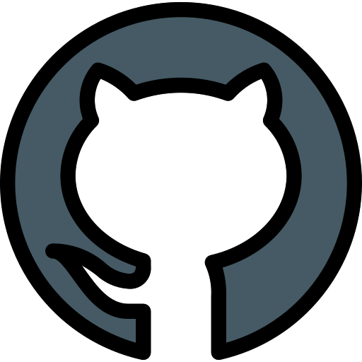

### [rsschool-cv](rsccool-cv)
# Maria Dark 
### Junior Frontend Developer

> \
 &nbsp; &nbsp; &nbsp; +7 (910) 444-24-43 \
 &nbsp; &nbsp; &nbsp;  darkmaria.se@gmail.com \
  &nbsp; &nbsp; &nbsp; [mariadark](https://www.linkedin.com/in/mariadark/) \
 &nbsp; &nbsp; &nbsp; [Maria-Dark](https://github.com/Maria-Dark) \
  &nbsp; &nbsp; &nbsp; Russia, Kaliningrad \
&nbsp;


### About Me
I have been working as a tester for 8 years. In the process of studying automation testing in js, also I became interested in front-end development.

---


### Skills
- HTML5, CSS3
- JavaScript
- Jest
- Git
- Confluence

---


### Code Examples 

```
const getSmile = () => '😊';
getSmile();
```

---

### Exaple projects
- JavaScript Trees [Difference Calculator](https://github.com/Maria-Dark/frontend-project-46/blob/main/README.md)
- JavaScript Basic [Parity Check](https://github.com/MariaShalunova/backend-project-44/blob/main/README.md)


### Languages
**Russian** - Native \
**English** - A2 (B1 in process…)